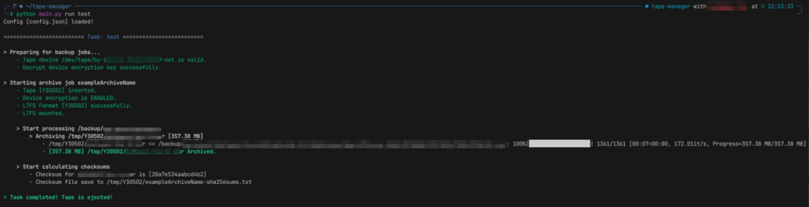
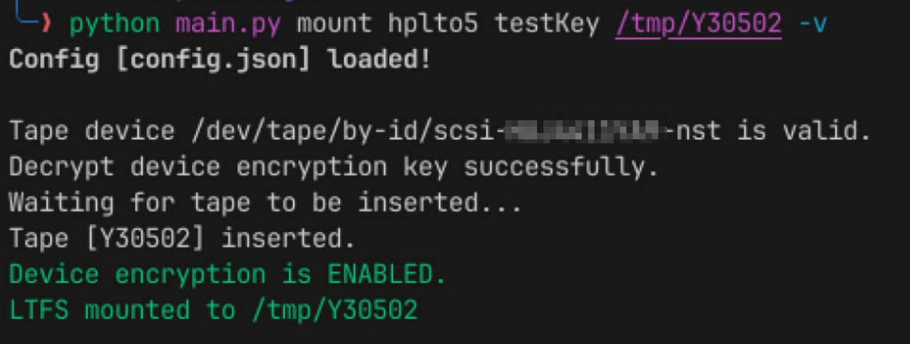
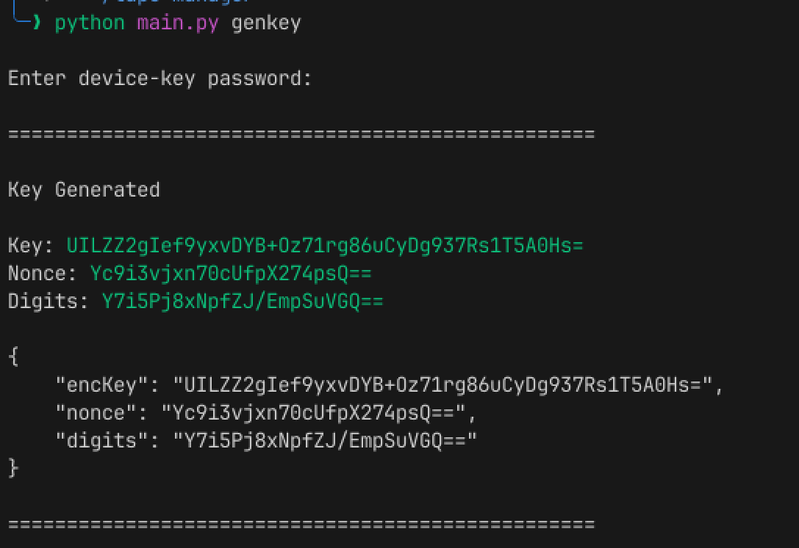

# Tape Manager

Helps you archive your backup into tape!

## Usage

It is very simple.

```bash
# Install requirements, if you haven't done it yet.
pip install -r requirements.txt

# Display usage
python main.py
```

and checkout the ``config.example.json``  

#### Run backup task


#### Mount tape


### Generate encrypted device-encryption key


## Requirements

These linux binaries should exist:
- mkltfs
- ltfs
- mt-gnu
- mt-st
- stenc
